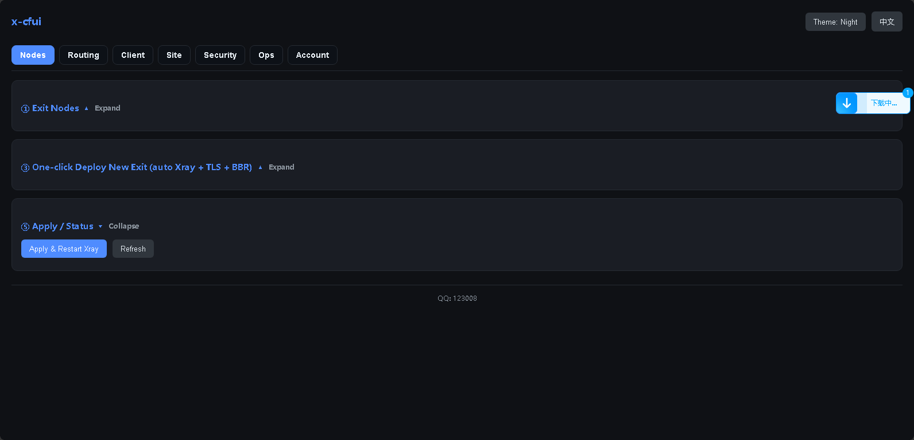
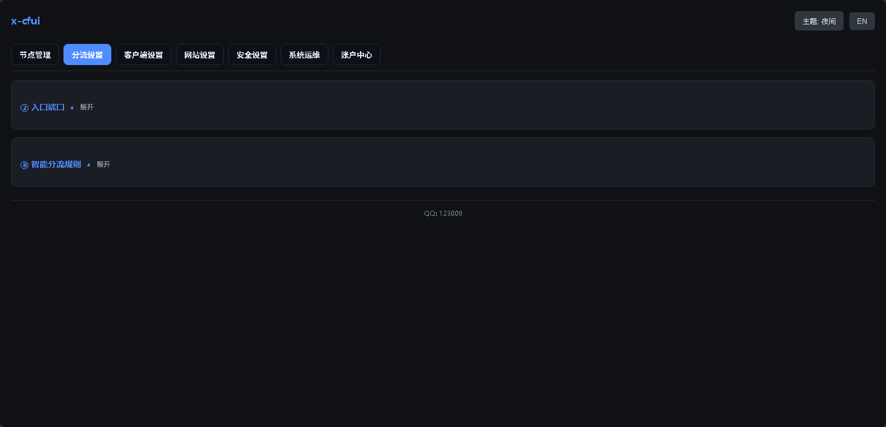
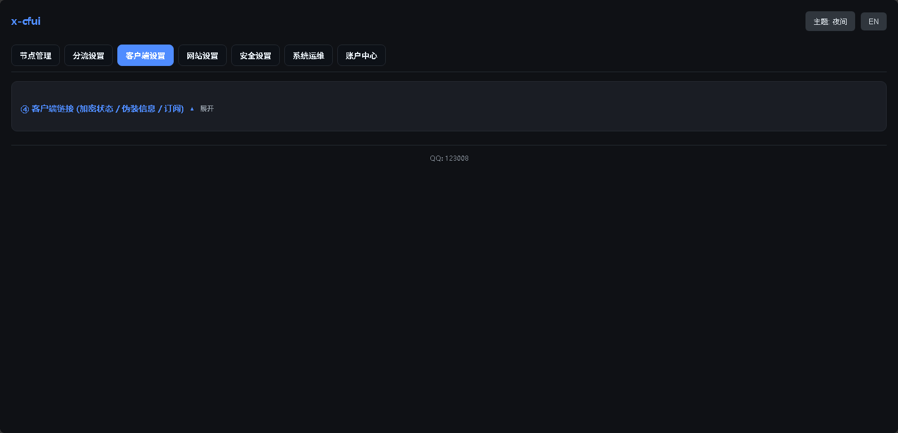

# x-cfui — Xray Relay Management Panel

## ⚠️ Legal Notice

This project is intended for lawful purposes only:
- ✅ Enterprise cross-border office network acceleration
- ✅ Academic research and network technology research
- ✅ Personal network architecture learning and practice
- ✅ Other uses that comply with applicable laws

**Prohibited uses include but are not limited to:**
- ❌ Bypassing national network censorship
- ❌ Accessing websites and content prohibited by law
- ❌ Engaging in any illegal activities

**Users must comply with all applicable laws in their jurisdiction. The developer is not responsible for any consequences resulting from illegal use. By using this software, you agree to comply with all applicable laws.**

---

> A lightweight, full-featured, single-file Xray relay management panel.
> Deploy in one command, ready to use out of the box.

[](LICENSE)
[](https://python.org)
[](https://github.com/XTLS/Xray-core)

---

## 📸 Screenshots

| Node Management | Routing Settings | Client Settings |
|-----------------|------------------|-----------------|
|  |  |  |

---

## ✨ Features

### Full-Featured Panel
- **Single-File Architecture** — The entire panel is just one `app.py` (Python Flask), with backend + frontend + HTML/CSS/JS + i18n all embedded
- **Lightweight & Fast** — Source file only 217KB, zero external frontend dependencies
- **One-Click Deploy** — Single command deploys panel + Xray + firewall + BBR + fail2ban
- **Offline Ready** — All dependencies (Xray binary, Python libs) bundled, no network downloads needed

### Multi-Node Relay Management
- Manage **Entry Server / Exit Node A / Exit Node B** across three servers
- Supports **VMess / VLESS / Shadowsocks / Trojan / Hysteria2 / WireGuard** and more
- Auto-generate **Reality** config (TLS fingerprint spoofing)
- One-click BBR status verification for exit nodes
- Editable node names

### Security Protection
- **Panel Login Brute-Force Protection** — Auto-ban after 17 failed attempts in 60 seconds (configurable)
- **SSH Brute-Force Protection (fail2ban)** — Unified config across all three servers
- **UFW Firewall** — Automatic port rule management
- **SSH Hardening** — One-click enable key-only auth, change port

### System Operations
- **Full Config Backup/Restore** — One-click backup of panel + system configs (455 items), supports offline migration
- **Factory Template** — Portable routing/site config templates without server credentials
- **Boot Auto-Start Verification** — One-click check service status on all three servers
- **Port Usage Detection** — Real-time port usage monitoring
- **GeoIP Database Management** — Online update of geoip.dat / geosite.dat

### Client Connections
- Multi-domain/multi-address management (add/delete)
- Auto-generate connection strings + QR codes for all protocols
- PC / Android / iOS client subscriptions supported
- One-click switch between Chinese/English UI

---

## 🚀 Quick Start

### Method 1: Deploy from Source (Recommended, Fully Offline)

```bash
git clone https://github.com/qqqq123008/x-cfui.git
cd x-cfui
sudo bash deploy_xcfui.sh
```

> `deploy_xcfui.sh` has Xray binary + segno library embedded, fully offline, no network downloads needed.

### Method 2: Download Pre-Built Release

Download `xcfui-deploy.sh` from [GitHub Releases](https://github.com/qqqq123008/x-cfui/releases):

```bash
sudo bash xcfui-deploy.sh
```

Both are identical — the pre-built release is just a base64-wrapped single file.

The script automatically:
- ✅ Installs Xray + nginx + ufw + fail2ban
- ✅ Generates random panel entry, admin credentials, client UUID
- ✅ Configures BBR TCP acceleration
- ✅ Opens firewall ports
- ✅ Configures fail2ban brute-force protection
- ✅ Registers systemd service for auto-start on boot
- ✅ Starts the panel (default port 5000)

After deployment, visit: `http://SERVER_IP:5000/RANDOM_ENTRY_TOKEN`

---

## 🏗 Architecture

```
┌─────────────┐     ┌─────────────┐     ┌─────────────┐
│   Client    │────▶│Entry Server │────▶│ Exit Node A │
│  (v2rayNG)  │     │   (Panel)   │     │   (Relay)   │
│(Shadowrocket│     │    xray     │     │    xray     │
└─────────────┘     └─────────────┘     └─────────────┘
                           │
                           ▼
                    ┌─────────────┐
                    │ Exit Node B │
                    │   (Relay)   │
                    └─────────────┘
```

- **Entry Server**: The server hosting the panel, clients connect directly, handles traffic distribution
- **Exit Node A / Exit Node B**: Relay nodes that process actual proxy requests

---

## 🧩 Tech Stack

| Component | Technology |
|-----------|------------|
| Backend Framework | Python Flask (embedded in app.py) |
| Frontend | Native HTML + CSS + JavaScript (no framework) |
| QR Code | segno (Python) |
| i18n | Built-in Chinese/English dual language |
| Proxy Core | Xray-core v26.3.27 |
| Firewall | ufw + nftables |
| Protection | fail2ban |
| TCP Acceleration | BBR |

---

## 🔧 Development

```bash
# 1. Edit app.py
vim app.py

# 2. Syntax check
python3 -m py_compile app.py

# 3. Static audit
python3 audit_panel.py

# 4. Build single-file script (optional)
python3 make_xcfui.py

# 5. Push to server for testing
python3 deploy_panel.py
```

---

## 📋 Roadmap

- [x] Panel core framework (node management, client links, QR codes)
- [x] Multi-node management and status monitoring
- [x] Brute-force protection + fail2ban integration
- [x] Full config backup/restore/migration
- [x] SSH hardening
- [x] Boot auto-start verification
- [x] Navigation UI refactoring
- [x] Multi-address client support
- [x] Offline deployment (embedded Xray + segno)
- [x] Service status sync on migration
- [ ] ...

---

## ⚖️ License

[MIT](LICENSE)

Copyright (c) 2026

---

## 🙏 Acknowledgments

- [XTLS/Xray-core](https://github.com/XTLS/Xray-core)
- [segno](https://github.com/heuer/segno)
